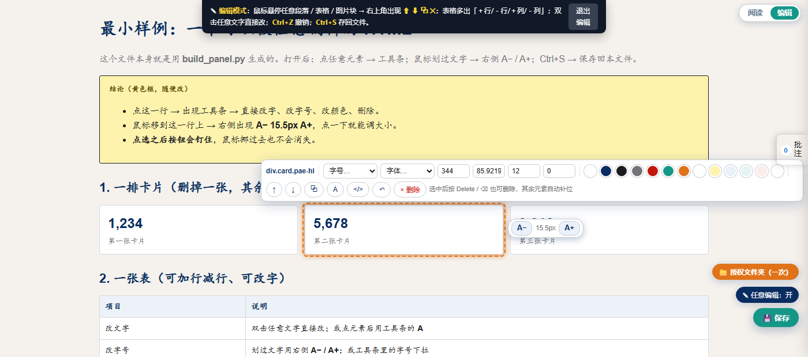
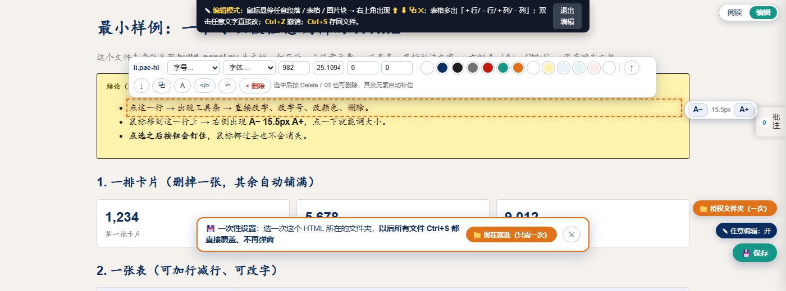
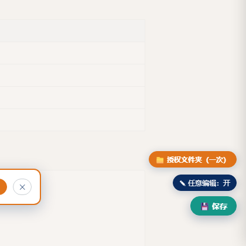

<div align="center">

# ✨ Jerry Editable HTML

**把任何单文件 HTML，变成「像 Word 一样能改、能批注、Ctrl+S 就地保存」的活文档**

写报告的人不用再求前端，收报告的人不用再截图写意见。


**▶ 先玩一下：下载 [`examples/demo.html`](examples/demo.html) 双击打开**　·　[30 秒原理](#-30-秒看懂它到底做了什么)　·　[三步用法](#-三步用法)　·　[真实用例](#-七个真实用例)



<sub>↑ 点一下卡片，工具条就出来了：改字号 / 字体 / 宽高 / 边距 / 颜色 / 排序 / 复制 / 改源码 / 删除；右边那个 `A− 15.5px A+` 是划到哪段就调哪段。</sub>

</div>

---

## 😵 你是不是也遇到过这些事

| 场景 | 平时的痛 |
|---|---|
| 📊 **研究报告做成了网页** | 老板说"第三段改一下、这个表格删掉"——你只能回去改源码，重新导出，再发一遍 |
| 📝 **给同事 / 客户的材料** | 对方的意见是截图 + 红框 + "这里""那里"，你还得自己找位置 |
| 📈 **数据看板 / 周报** | 网页很好看，但想调个字号、换个顺序，就得找前端同学 |
| 🧾 **专家访谈纪要** | 边听边记，回头想把重点标出来、补两句结论，格式一动就乱 |
| 📚 **自己的知识库** | 攒了一堆 HTML 笔记，改起来比 Markdown 还麻烦 |

**这个项目就是来解决这件事的。**

---

## 🎯 30 秒看懂它到底做了什么

你**什么都不用换** —— 还是原来那个 HTML 文件。

它只是在文件末尾追加了两段 **零依赖的 JavaScript** 和一小段 CSS（合计约 110KB，无网络请求、无 CDN、无框架）：

```
你的 HTML  ──►  build_panel.py  ──►  还是同一个 HTML，但打开后多了 ↓
                                     ┌────────────────────────────────────┐
                                     │  阅读 ｜ 编辑  ← 右上角一键切换      │
                                     │  ✎ 任意元素编辑    💾 就地保存       │
                                     │  🖍 文字批注       A− A+ 字号微调    │
                                     └────────────────────────────────────┘
```

**打开时默认是「阅读模式」** —— 干净、不打扰、导航链接都能点。
右上角切到「**编辑**」，整份文档立刻变成可改的。

- **不需要服务器**：`file://` 双击就能用
- **不需要构建工具**：没有 npm / webpack / React
- **不需要联网**：断网照样用
- **发给谁，能力就跟到谁**：因为代码和数据都在文件里

---

## 🚀 三步用法

### 1️⃣ 写内容（就是普通 HTML）

照抄 [`examples/minimal-example.html`](examples/minimal-example.html) 改内容即可。要求只有一条：**文件自带 `<style>…</style>`**。

### 2️⃣ 一条命令，变成可编辑版

```bash
python assets/build_panel.py  你的内容.html  输出.html
```

### 3️⃣ 交付前自检（强烈建议，全绿再发）

```bash
python assets/verify_panel.py 输出.html
```

自动检查：**JS 语法 → 页面报错 → SVG 图表文字越界 → 图表标签互相重叠 → 浮动按钮有没有被遮住 → 编辑器 UI 有没有被重复注入**。

<details>
<summary>看一个真实的自检输出（点开）</summary>

```
[1] JS 语法检查：3 个 script
    uiCount = 1
    hasAnyeditData = true
    hasNotesData = true
    PVAnyEdit = object
    PVNotes = object
    jserr =
    sections = 10
    svgCount = 9
    hit0 = self          ← 浮动按钮没有被遮挡
    hit1 = self
    hit2 = self
[2] SVG 审计：9 张，问题 0 处

===== 结论 =====
  结果：全部通过 ✅
```
</details>



<sub>↑ 不用先选中：鼠标划到哪一段，右边就浮出 `A− 当前字号 A+`；**点一下那段文字按钮会"钉住"**，鼠标挪过去也不会跑掉。</sub>



**右下角三个按钮**（从下往上）：

- **💾 保存** —— 等价于 `Ctrl+S`，直接覆盖原文件
- **✎ 任意编辑** —— 临时开关编辑态（不想看悬浮提示时关掉）
- **📁 授权文件夹（一次）** —— **点一次，整个文件夹永久免弹窗**；授权成功后这个按钮会自己消失

> 环境要求：**Python 3**（只用标准库）。自检额外用到 Chrome 与 Node，没有也能跑（退化成结构检查）。

---

## 🖱️ 打开之后，能做什么

| 想做的事 | 怎么做 |
|---|---|
| **开始改** | 右上角把「阅读 ｜ 编辑」切到 **编辑**（选择会记住） |
| **改一段文字** | 双击它，直接打字（或点元素 → 工具条上的 `A`） |
| **改字号** | 鼠标划过那段文字 → 右侧浮出 `A− 15.5px A+`；**点一下那段文字，按钮会"钉住"**，可以连点好几下 |
| **改颜色 / 字体 / 宽高 / 边距** | 点元素 → 工具条上直接改（宽高可填 `auto`、`60%`） |
| **删掉一个表格 / 一张卡片** | 选中 → 按 `Delete` 或 `Backspace`，**其余元素自动补位**（一排卡片删掉一个，剩下的自动铺满整行） |
| **调换顺序** | 选中 → 工具条 `⬆` `⬇` |
| **复制一块** | 选中 → `⧉` |
| **改标签 / class / 源码** | 选中 → `</>` 直接编辑这段 HTML |
| **改图表里的数字** | 点图表里的数字 → 字号 / 文字 / 颜色 / 方向微调 / 删除，**连 SVG 都能改** |
| **加批注** | 选中一句话 → 点浮出的「＋ 批注」→ `Ctrl+Enter`；右缘「批注」标签里可定位、标已处理、导出 `.md` |
| **撤销** | `Ctrl+Z`（删除、移动、样式都能撤） |
| **保存** | **`Ctrl+S`** 或点右下角 **「💾 保存」** —— 直接覆盖原文件 |
| **安静阅读** | 点右下角把「✎ 任意编辑」关掉，导航 / 翻页照常可用 |

---

## 🧩 七个真实用例

### 1. 投研 / 行业研究面板
> 几十页的行业分析，十几个章节、九张手写 SVG 图表。
> **用法**：老板直接在页面上改结论、删掉不想留的那张表、把某个数字调大加粗。改完 `Ctrl+S`，文件还是那一个，转发即可。
> **为什么合适**：连"由 JS 渲染出来的内容"也能改（内置冻结机制，见 [技术一览](#-它是怎么做到的三个关键设计)）。

### 2. 投资决策讨论稿 / 汇报稿
> 需要在会上当场记意见。
> **用法**：讲到哪一段，选中 → 「＋ 批注」写下分歧；会后导出 `.md` 直接进纪要。

### 3. 专家访谈纪要
> 一份纪要要发给多位同事补充。
> **用法**：发出去 → 各自在自己的副本上批注 / 改字 → 发回 → 用「导入」按 id 合并，**不会覆盖对方的意见**。

### 4. 客户 / 对外交付物
> 客户看完要微调措辞，但你没有前端排期。
> **用法**：交付可编辑版，客户自己改，改完存回同一个文件发回来 —— 仍然是**一个文件**，不需要 zip、不需要账号、不需要登录。

### 5. 数据周报 / 运营看板
> 数字每周变，但版式固定。
> **用法**：模板交给业务同学，他们自己填数字、调 KPI 卡片数量（删一张，剩下的自动补位）。

### 6. 培训材料 / 教学课件
> 一套内容要给不同受众讲。
> **用法**：提前删掉不讲的部分（`Delete` 自动补位），或按需调大字号；原始版本不动。

### 7. 个人知识库 / 读书笔记
> 攒了一堆 HTML 笔记，改起来麻烦。
> **用法**：双击改字、A−/A+ 调层级、`Ctrl+S` 存回 —— 比 Markdown 顺手，又保留网页的排版能力。

---

## 🛠 它是怎么做到的：三个关键设计

<details>
<summary><b>① 三层架构，全部写在同一个文件里</b></summary>

| 层 | 作用 | 数据存放 |
|---|---|---|
| **编辑层** `pv-anyedit.js` | 任意元素选择、工具条、A−/A+、删除补位、就地保存 | `<script id="pv-anyedit-data">` |
| **批注层** `pv-notes.js` | 选中文字批注、锚点定位、导入合并、导出 md | `<script id="pv-notes-data">` |
| **内容层** | 你自己的 HTML | 就是文件本身 |

所以文件发给谁，这三层就一起跟过去，不依赖任何外部服务。
</details>

<details>
<summary><b>② 冻结机制 —— 为什么"改得动"</b></summary>

很多 HTML 面板的正文是 **JS 在打开时现算出来的**：你在浏览器里删掉一个表格，刷新一下它又回来了。

这里的做法是：任何结构改动都会把**最近的带 id 容器**整块快照进 `pv-anyedit-data.frozen`，页面加载时在**渲染完成之后**再塞回去，并用 `MutationObserver` 兜底。所以：

> **你的编辑永远赢 —— 刷新、关闭、重开、转发，改动都在。**
</details>

<details>
<summary><b>③ 保存链 —— 为什么能 Ctrl+S，以及"第一次为什么要授权"</b></summary>

| 优先级 | 条件 | 结果 |
|---|---|---|
| 1 | 已授权过某个**文件夹** | 直接写同名文件 —— **零弹窗**，且对该文件夹里所有文件都有效 |
| 2 | 已记住这个**文件**的句柄 | 直接覆盖 —— **零弹窗** |
| 3 | 都没有（本机第一次） | **弹一次"选择文件夹"**：选中这个 HTML 所在的文件夹 → 立刻覆盖保存，**并且从此永久免弹窗**（该文件夹下所有文件） |

> 第 3 步刻意用了「选文件夹」而不是「另存为」：因为选一次文件夹 = **以后所有文件都不用再选**；而"另存为"只能记住一个文件。用户若取消，会自动退回普通的"另存为"对话框。

> **第一次一定要授权一次，绕不过去**：浏览器不允许网页未经允许写磁盘，而且磁盘路径字符串无法变成可写句柄 —— 网页没有办法自己知道"我这个文件在哪个文件夹里"（Chrome 也没有提供"从文件反查所在目录"的接口）。这是浏览器的安全模型，任何方案都做不到"完全不授权就写文件"。
>
> **但可以把这一次降到最低 —— 而且只需要做一次：**
>
> | 做法 | 成本 | 效果 |
> |---|---|---|
> | 点一次 **「📁 授权文件夹（一次）」** | 选一次文件夹 | **整个文件夹永久免弹窗**（以后任何一版 HTML 都直接覆盖） |
> | 把当前 HTML **拖进页面** | 拖一下 | 零弹窗，仅这一个文件 |
> | 什么都不做，直接 `Ctrl+S` | 弹一次"另存为"（**文件名已预填、按回车即可**） | 这个文件以后不再弹 |
>
> 页面首次打开、检测到还没授权时，**底部会自动弹出一次性设置引导条**，点一下就完成。
</details>

**零依赖**：没有 npm、没有框架、没有 CDN、没有网络请求。

---

## 📁 目录结构

```
Jerry-Editable-HTML/
├─ SKILL.md                        # 完整施工 SOP（11 条不可协商规则 / 交付检查清单 / 6 个假通过陷阱）
├─ README.md                       # 本文件
├─ assets/
│  ├─ build_panel.py               # ① 一键生成可编辑版
│  ├─ verify_panel.py              # ② 一键自检
│  ├─ pv-anyedit.js                # 任意元素编辑器（默认开：字号微调 / 删除补位 / 保存链）
│  ├─ pv-notes.js                  # 批注 / 就地编辑 / 保存链
│  ├─ inject_pvnotes.py            # 只补批注层（给已有老面板加批注时用）
│  └─ 收件人一页说明.md             # 随文件转发给阅读者的一页说明
├─ docs/
│  └─ 实现原理与上手手册.md          # 三层架构 / 锚点算法 / 保存链 / 全部实现细节
└─ examples/
   ├─ minimal-example.html         # 最小可用样例（内容可整段替换）
   └─ demo.html                    # ⭐ 已经生成好的可编辑版，双击即可体验
```

---

## ⚡ 想连"第一次的授权框"都不要？开「本地保存助手」

浏览器的规矩是：网页第一次写磁盘必须由你授权一次（而且网页无从知道自己在哪个文件夹）。
如果你连这一次都不想点 —— 项目里带了一个 **20 行的本地小助手**：

```bash
# 双击即可（Windows）
tools/pv-save-helper/启动保存助手.cmd

# 或者命令行
powershell -NoProfile -ExecutionPolicy Bypass -File tools/pv-save-helper/pv-save-helper.ps1 -Roots "D:\你的文件夹"
```

它只做一件事：在本机 `127.0.0.1:8765` 上监听，面板 Ctrl+S 时把内容 POST 过来，**按页面自己的路径写回原文件**。

| | 不装助手 | 装了助手 |
|---|---|---|
| 第一次 Ctrl+S | 弹一次"选择文件夹" | **不弹，直接保存** |
| 之后每次 | 直接覆盖 | 直接覆盖 |
| 需要按回车吗 | 第一次要 | **永远不用** |

**安全边界做得很窄**（代码很短，可以自己审一遍）：
只监听 `127.0.0.1` ｜ 只接受 `.html`/`.htm` ｜ 只允许写 `-Roots` 指定的目录 ｜ **目标文件必须已存在**（只覆盖、不新建）｜ 原子写（`.tmp` + 替换）。
纯被动监听，没有轮询、没有后台循环；关掉窗口即停止，面板会自动退回浏览器原生方式。
可选：`安装开机自启.cmd` 一键注册登录自启，`卸载开机自启.cmd` 随时取消。

---

## 📤 分享给同事：他们也一样不用弹窗

一条命令打成一个 zip：

```powershell
.\打包分享.ps1            # 生成 xxx_分享包.zip（面板 + 助手 + 一页说明）
```

| 同事的用法 | Ctrl+S 的结果 |
|---|---|
| 只想改改再发回来（**什么都不用装**） | **下载一份改好的副本**（零弹窗）→ 发回给你 |
| 想就地覆盖（双击一次助手即可） | **直接覆盖原文件**（零弹窗、零操作） |

> 为什么不能"什么都不做就覆盖"？因为浏览器不允许网页未经允许写磁盘，而且网页无从得知自己在哪个文件夹
> （Chrome 没有 `getParent()`，也没有"路径 → 句柄"的 API）。**"下载副本"是唯一不需要任何授权的零弹窗保存方式** ——
> 而对"发出去给别人改"这个场景，它本来就是更合理的语义。

---

## ❓ FAQ

**Q：改了以后重新跑 `build_panel.py`，之前的修改会丢吗？**
会。修改存放在**生成出来的那个 HTML 文件里**。要重做内容就重新 build；想保留修改就直接在那个文件上继续改。

**Q：能不要批注层吗？**
可以。编辑层与批注层完全独立，去掉 `build_panel.py` 里的对应注入块即可。

**Q：支持手机吗？**
能打开、能看。编辑建议在电脑上做（需要鼠标悬停、键盘 `Delete` / `Ctrl+Z`）。

**Q：能放到 GitHub Pages 上吗？**
可以，但**只有本地 `file://` 打开时"就地保存回原文件"才成立**。放到网站上时，保存会退化成下载一份副本。

**Q：几十张 SVG 图表会不会卡？**
不会。高亮只作用于鼠标悬停的元素，屏幕外章节会自动暂停动画。

**Q：能用在商业项目里吗？**
可以，MIT License。

---

## 📄 License

MIT License —— 随便用、随便改、随便商用，保留版权声明即可。

<div align="center">

**如果它帮你省下了一次"回去改源码再发一遍"，那就值了。**

</div>
